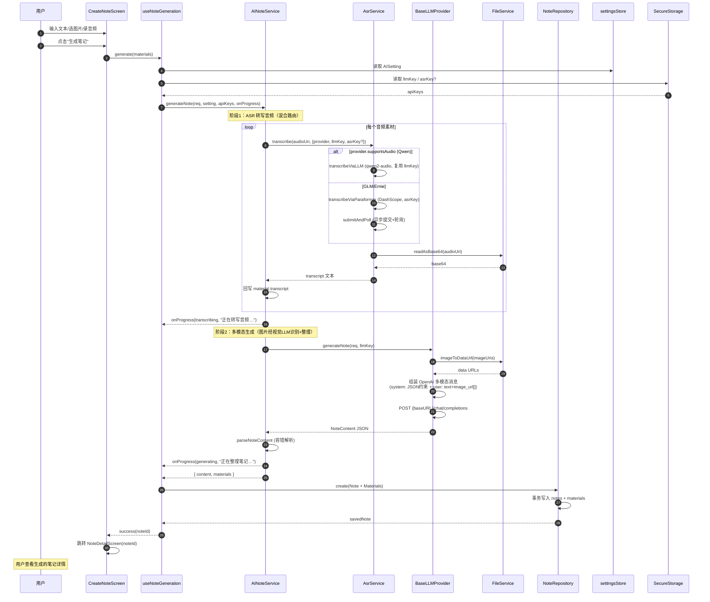
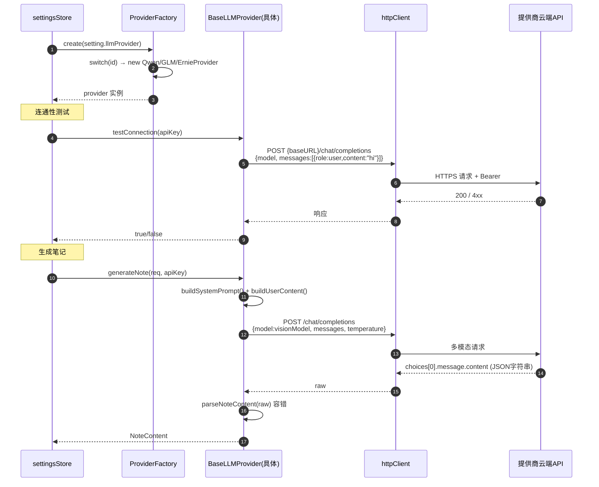
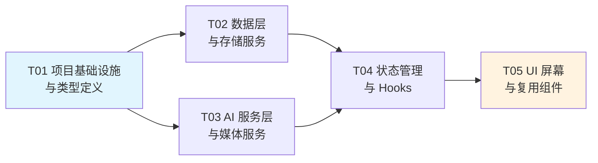

# 笔灵 BiLing — 系统架构设计文档

> **项目**：笔灵 BiLing — AI 智能笔记 App
> **角色**：架构师 Bob（高见远）
> **基于**：产品经理许清楚的 PRD
> **交付对象**：工程师 寇豆码
> **技术栈**：React Native（TypeScript）+ 国内多模态大模型 + 本地 SQLite

---

## 目录

1. [实现方案概述](#1-实现方案概述)
2. [框架与依赖选型](#2-框架与依赖选型)
3. [文件列表及路径](#3-文件列表及路径)
4. [数据结构和接口设计](#4-数据结构和接口设计)
5. [程序调用流程](#5-程序调用流程)
6. [任务列表](#6-任务列表critical)
7. [依赖包列表](#7-依赖包列表)
8. [共享知识（跨文件约定）](#8-共享知识跨文件约定)
9. [待明确事项](#9-待明确事项)

---

## 1. 实现方案概述

### 1.1 技术栈选型说明

| 层面 | 选型 | 版本 | 说明 |
|------|------|------|------|
| 框架 | React Native | ^0.76.0（推荐 0.81+，启用 New Architecture） | 跨平台 iOS/Android；0.76+ 默认新架构，性能与 TurboModule 支持 |
| 语言 | TypeScript | ^5.6 | 全量 TS，类型安全 |
| 状态管理 | Zustand | ^5.0 | 轻量、无样板代码、天然支持 RN；比 Redux Toolkit 更适合中等规模 MVP |
| 本地数据库 | expo-sqlite | ^15.0 | 在 bare RN CLI 中通过 expo 模块可用；API 现代（openSync / prepareAsync），性能优于旧版 sqlite-storage |
| 加密存储 | expo-secure-store | ^14.0 | iOS Keychain / Android EncryptedSharedPreferences，用于 API Key 加密存储 |
| 导航 | @react-navigation v7 | ^7.0 | 社区标准；bottom-tabs + native-stack |
| 摄像头/相册 | expo-image-picker | ^16.0 | 统一拍照 + 相册选择，权限处理完善 |
| 音频录制 | expo-audio | ^2.0 | Expo SDK 51+ 新录音 API（expo-av 已废弃，录音用 expo-audio） |
| 文件系统 | expo-file-system | ^18.0 | 音频/图片文件读写、base64 编码 |
| Markdown 渲染 | react-native-markdown-display | ^7.0 | 笔记正文 Markdown 渲染 |
| 网络请求 | axios | ^1.7 | 拦截器、超时控制、流式响应支持更好 |
| UI 组件 | 纯自定义 + StyleSheet | — | 全局主题系统，不引入重型 UI 库，保证"Get笔记"式自定义观感与体积可控 |

### 1.2 核心技术挑战与对策

1. **多 LLM 提供商适配**：通义千问（DashScope）、智谱 GLM、文心一言三家的 Chat 接口均已兼容 OpenAI 格式。**对策**：抽象 `BaseLLMProvider` 基类 + 共享 OpenAI 兼容 HTTP 客户端，各 Provider 仅配置 `baseURL / model / visionModel`，避免重复实现。
2. **多模态融合（图片 OCR）**：PRD 流程中"OCR 识别"作为独立步骤。**对策**：利用各家的视觉大模型（qwen-vl-plus / glm-4v-plus / ernie-4.5-vl），将图片以 OpenAI `image_url`（base64）内容块直接送入生成请求，由 LLM 在生成笔记时一并"看图理解"。这样 OCR 与笔记整理合并为一次多模态调用，质量更高、调用更少；ASR 仍为独立步骤（音频无法直接送入文本/视觉 Chat API）。
3. **音频转写（ASR）**：三家 LLM 的 Chat 接口不直接吃音频。**对策**：采用**混合 ASR 策略**——首选提供商原生音频模型（通义千问 `qwen2-audio-instruct`，经 OpenAI 兼容接口发送 `audio_url` 内容块，**复用 LLM Key、零额外配置**）；当所选提供商无音频模型（智谱 GLM / 文心一言）时，回退到阿里云 DashScope `paraformer` 专用 ASR（需独立 ASR Key）。`AsrService` 依据 `provider.supportsAudio` 自动路由，对调用方透明。
4. **API Key 安全**：**对策**：Key 仅存于 `expo-secure-store`，SQLite 的 settings 表只存非敏感配置（provider、model、主题、排序），绝不落盘明文密钥。
5. **AI 生成是耗时操作**：**对策**：`AINoteService` 通过回调 `onProgress` 驱动"AI 生成中"页面的阶段提示（转写音频 → 识别图片 → 整理笔记），并支持取消。

### 1.3 分层架构

```
┌─────────────────────────────────────────────────────────┐
│                     UI 层 (Screens + Components)         │
│   NoteList / CreateNote / AIGenerating / Detail / ...    │
└───────────────▲─────────────────────────┬───────────────┘
                │ useStore / hooks          │ props / events
┌───────────────┴─────────────────────────▼───────────────┐
│                  状态管理层 (Zustand Stores)              │
│        noteStore  /  settingsStore  /  uiStore            │
└───────────────▲─────────────────────────┬───────────────┘
                │ 调用                      │ 持有/触发
┌───────────────┴─────────────────────────▼───────────────┐
│                     服务层 (Services)                     │
│  AINoteService │ LLMProvider(Factory) │ AsrService        │
│  ImageService  │ AudioService         │ FileService       │
│  SecureStorage │ *Repository(db)                          │
└───────────────▲─────────────────────────┬───────────────┘
                │ SQL / IO                  │ Keychain/FS
┌───────────────┴─────────────────────────▼───────────────┐
│                     数据层 (Data)                         │
│      SQLite (expo-sqlite)   │   Secure Store   │   FS     │
└─────────────────────────────────────────────────────────┘
```

**分层依赖方向**：UI → 状态管理 → 服务层 → 数据层（单向，禁止反向依赖）。服务层内部：`AINoteService` 编排 `LLMProvider` + `AsrService`；Repository 封装 SQLite。

---

## 2. 框架与依赖选型

| 包名 | 用途 | 选择理由 |
|------|------|----------|
| `react-native` ^0.81 | App 框架 | 新架构成熟、TurboModule、生态最新 |
| `react` ^18.3 / `react-native` 对齐 | UI 运行时 | — |
| `typescript` ^5.6 | 类型系统 | 全量类型安全 |
| `expo` ^53 | Expo 模块宿主 | bare RN 中使用 expo-sqlite 等需安装 expo 核心 |
| `expo-sqlite` ^15 | 本地数据库 | 现代 API、性能好、跨平台一致 |
| `expo-secure-store` ^14 | API Key 加密存储 | 系统级加密（Keychain / EncryptedPrefs） |
| `expo-image-picker` ^16 | 拍照/相册 | 权限处理完善、统一接口 |
| `expo-audio` ^2 | 录音 | 替代已废弃的 expo-av 录音能力 |
| `expo-file-system` ^18 | 文件读写/base64 | 音频、图片文件处理 |
| `expo-document-picker` ^13 | 音频文件选择 | 实现 REQ-005 从文件系统选音频文件 |
| `expo-image-manipulator` ^13 | 图片压缩/缩放 | 实现 PRD 4.1.2 图片预处理（长边≤1920px、≤2MB） |
| `react-native-view-shot` ^4 | 视图截图 | P1 分享"长图"：将笔记渲染为图片分享 |
| `@react-native-async-storage/async-storage` ^2 | 轻量偏好存储 | 存主题、排序等简单配置（非敏感） |
| `zustand` ^5 | 状态管理 | 轻量、无样板、TS 友好 |
| `@react-navigation/native` ^7 | 导航核心 | 社区标准 |
| `@react-navigation/native-stack` ^7 | 栈导航 | 详情/编辑/设置页栈 |
| `@react-navigation/bottom-tabs` ^7 | Tab 导航 | 笔记列表/新建/设置 |
| `react-native-screens` ^4 | 原生屏幕容器 | 导航性能依赖 |
| `react-native-safe-area-context` ^5 | 安全区域 | 刘海/手势条适配 |
| `react-native-gesture-handler` ^2 | 手势 | 导航与交互依赖 |
| `react-native-reanimated` ^3 | 动画 | 流畅原生动画（可选，列表/过渡用） |
| `axios` ^1.7 | HTTP 请求 | 拦截器、超时、SSE 流式支持 |
| `react-native-markdown-display` ^7 | Markdown 渲染 | 笔记正文展示 |
| `uuid` ^10 | ID 生成 | 笔记/素材唯一 ID |

> **安装约定**：所有 `expo-*` 模块使用 `npx expo install <pkg>` 安装，以确保与已安装的 Expo SDK 版本严格兼容。

---

## 3. 文件列表及路径

```
ainote-app/
├── package.json                     # 依赖声明
├── babel.config.js                  # Babel 配置（含 reanimated 插件）
├── tsconfig.json                    # TS 配置
├── metro.config.js                  # Metro 打包配置
├── app.config.js                    # Expo 配置插件（权限声明）
├── index.js                         # RN 入口（注册 App）
├── App.tsx                          # 根组件（Provider 装配 + 导航）
├── docs/
│   ├── ARCHITECTURE.md              # 本文档
│   ├── class-diagram.mermaid        # 类图
│   └── sequence-diagram.mermaid     # 时序图
└── src/
    ├── types/                       # ===== 类型定义 =====
    │   ├── note.ts                  # Note / Material / Category 类型
    │   ├── ai.ts                    # AISetting / NoteContent / Provider 类型
    │   ├── navigation.ts            # 路由参数类型
    │   └── index.ts                 # 统一导出
    ├── constants/                   # ===== 常量 =====
    │   ├── theme.ts                 # 颜色/字体/间距（明暗双主题）
    │   ├── providers.ts             # 三家 LLM/ASR 提供商配置
    │   └── config.ts                # 应用级常量（DB名/超时/提示词模板）
    ├── utils/                       # ===== 工具函数 =====
    │   ├── logger.ts                # 统一日志（dev 打印 / release 屏蔽）
    │   ├── id.ts                    # uuid 封装
    │   ├── date.ts                  # 时间格式化
    │   ├── markdown.ts              # Markdown 工具
    │   └── validation.ts            # 输入校验
    ├── services/                    # ===== 服务层 =====
    │   ├── db/
    │   │   ├── database.ts          # SQLite 连接 + 初始化
    │   │   ├── migrations.ts        # 建表 SQL / 迁移
    │   │   ├── NoteRepository.ts    # 笔记 CRUD
    │   │   ├── MaterialRepository.ts# 素材 CRUD
    │   │   ├── SettingsRepository.ts# 设置读写
    │   │   └── CategoryRepository.ts# 分类 CRUD
    │   ├── storage/
    │   │   ├── SecureStorage.ts     # expo-secure-store 封装（API Key）
    │   │   └── FileService.ts       # expo-file-system 封装
    │   ├── ai/
    │   │   ├── httpClient.ts        # axios 实例 + OpenAI 兼容请求封装
    │   │   ├── BaseLLMProvider.ts   # LLM 提供商抽象基类
    │   │   ├── providers/
    │   │   │   ├── QwenProvider.ts  # 通义千问
    │   │   │   ├── GLMProvider.ts   # 智谱 GLM
    │   │   │   └── ErnieProvider.ts # 文心一言
    │   │   ├── ProviderFactory.ts   # 按 provider id 创建实例
    │   │   ├── AsrService.ts        # DashScope paraformer 语音转写
    │   │   └── AINoteService.ts     # 编排：ASR + 多模态生成 → 笔记
    │   └── media/
    │       ├── ImageService.ts      # 拍照/选图 + 压缩（expo-image-picker + manipulator）
    │       └── AudioService.ts      # 录音(暂停/继续/停止) + 文件选择(document-picker)
    ├── store/                       # ===== 状态管理 =====
    │   ├── noteStore.ts             # 笔记列表/当前笔记/筛选排序
    │   ├── settingsStore.ts         # AI 设置/主题/排序偏好
    │   └── uiStore.ts               # 全局 UI 状态（loading/toast）
    ├── hooks/                       # ===== 自定义 Hooks =====
    │   ├── useNoteGeneration.ts     # 封装笔记生成全流程（进度/取消）
    │   ├── useNotes.ts              # 笔记列表加载/搜索/删除
    │   └── useTheme.ts             # 主题响应（system/light/dark）
    ├── navigation/                  # ===== 导航 =====
    │   ├── RootNavigator.tsx        # 根导航（Stack）
    │   └── MainTabNavigator.tsx     # 底部 Tab（列表/新建/设置）
    ├── screens/                     # ===== 页面 =====
    │   ├── OnboardingScreen.tsx      # 首次启动引导（检测API Key，引导配置）
    │   ├── NoteListScreen.tsx       # 笔记列表（搜索/排序/分类筛选）
    │   ├── CreateNoteScreen.tsx     # 新建笔记（文本/图片/音频 Tab）
    │   ├── AIGeneratingScreen.tsx   # AI 生成中（进度展示）
    │   ├── NoteDetailScreen.tsx     # 笔记详情（Markdown 展示）
    │   ├── NoteEditScreen.tsx       # 笔记编辑（富文本/Markdown）
    │   ├── SettingsScreen.tsx       # 设置（模型配置/连通性测试/高级/偏好/数据管理）
    │   └── CategoryManageScreen.tsx # 分类管理
    └── components/                  # ===== 复用组件 =====
        ├── TextInputPanel.tsx       # 文本输入面板
        ├── ImageInputPanel.tsx      # 图片输入面板（拍照/相册+预览）
        ├── AudioInputPanel.tsx      # 音频输入面板（录音+波形）
        ├── MaterialPreview.tsx      # 素材预览（统一展示三类素材）
        ├── NoteCard.tsx             # 笔记列表卡片
        ├── MarkdownRenderer.tsx     # Markdown 渲染封装
        ├── LoadingOverlay.tsx       # 加载遮罩
        ├── EmptyState.tsx           # 空状态占位
        ├── SearchBar.tsx            # 搜索栏
        ├── TagChip.tsx              # 标签芯片
        └── ProviderSelector.tsx     # 模型提供商选择器
```

---

## 4. 数据结构和接口设计

### 4.1 核心 TypeScript 数据模型

```typescript
// ============ src/types/note.ts ============

/** 素材类型 */
export type MaterialType = 'text' | 'image' | 'audio';

/** 素材：用户输入的原始内容 */
export interface Material {
  id: string;
  noteId: string;
  type: MaterialType;
  content: string;        // text: 文本内容; image/audio: 文件 URI
  transcript?: string;    // audio 的 ASR 转写结果
  ocrText?: string;       // image 的 OCR 结果（可选，预留）
  createdAt: number;
}

/** 笔记状态 */
export type NoteStatus = 'completed' | 'draft';

/** 笔记：AI 生成结果 + 关联素材 */
export interface Note {
  id: string;
  title: string;
  summary: string;
  keyPoints: string[];
  content: string;        // Markdown 正文
  tags: string[];
  categoryId: string | null;
  status: NoteStatus;
  materials: Material[];  // 关联素材（查询时 join）
  createdAt: number;
  updatedAt: number;
}

/** 分类 */
export interface Category {
  id: string;
  name: string;
  color: string;
  sortOrder: number;
  createdAt: number;
}

/** 列表排序方式 */
export type SortOrder = 'updated_desc' | 'updated_asc' | 'created_desc' | 'created_asc';

// ============ src/types/ai.ts ============

/** LLM 提供商标识 */
export type LLMProviderId = 'qwen' | 'glm' | 'ernie';

/** AI 设置（非敏感部分存 SQLite，密钥存 SecureStore） */
export interface AISetting {
  llmProvider: LLMProviderId;
  llmModel: string;
  visionModel: string;
  asrEnabled: boolean;
  temperature: number;
  maxTokens: number;        // PRD 4.4.1 高级设置
  themeMode: 'system' | 'light' | 'dark';
  sortOrder: SortOrder;
}

/** AI 输出的结构化笔记内容（LLM 返回 JSON） */
export interface NoteContent {
  title: string;
  summary: string;
  keyPoints: string[];
  content: string;       // Markdown
  tags: string[];
}

/** 生成笔记请求 */
export interface GenerateNoteRequest {
  text: string;                  // 用户输入文本
  imageUris: string[];           // 图片文件 URI 列表
  audioUris: string[];           // 音频文件 URI 列表
  materials: Material[];         // 已有素材（编辑重生成时）
}

/** 生成进度阶段 */
export type GenerationPhase =
  | 'idle'
  | 'transcribing'    // 转写音频
  | 'recognizing'     // 识别图片
  | 'generating'      // 整理笔记
  | 'done'
  | 'error';

/** 进度回调 */
export interface GenerationProgress {
  phase: GenerationPhase;
  message: string;
  detail?: string;
}

// ============ src/types/navigation.ts ============
import type { NativeStackScreenProps } from '@react-navigation/native-stack';

export type RootStackParamList = {
  MainTabs: undefined;
  NoteDetail: { noteId: string };
  NoteEdit: { noteId: string };
  CategoryManage: undefined;
};

export type TabParamList = {
  NoteList: undefined;
  CreateNote: undefined;
  Settings: undefined;
};

export type RootStackScreenProps<T extends keyof RootStackParamList> =
  NativeStackScreenProps<RootStackParamList, T>;
```

### 4.2 数据库表结构（SQLite）

```sql
-- notes: 笔记主表
CREATE TABLE IF NOT EXISTS notes (
  id           TEXT PRIMARY KEY,
  title        TEXT NOT NULL DEFAULT '',
  summary      TEXT NOT NULL DEFAULT '',
  content      TEXT NOT NULL DEFAULT '',
  key_points   TEXT NOT NULL DEFAULT '[]',   -- JSON array
  tags         TEXT NOT NULL DEFAULT '[]',   -- JSON array
  category_id  TEXT,
  status       TEXT NOT NULL DEFAULT 'completed',
  created_at   INTEGER NOT NULL,
  updated_at   INTEGER NOT NULL,
  FOREIGN KEY (category_id) REFERENCES categories(id) ON DELETE SET NULL
);

-- materials: 原始素材
CREATE TABLE IF NOT EXISTS materials (
  id         TEXT PRIMARY KEY,
  note_id    TEXT NOT NULL,
  type       TEXT NOT NULL,          -- text | image | audio
  content    TEXT NOT NULL DEFAULT '',
  transcript TEXT,
  ocr_text   TEXT,
  created_at INTEGER NOT NULL,
  FOREIGN KEY (note_id) REFERENCES notes(id) ON DELETE CASCADE
);

CREATE INDEX IF NOT EXISTS idx_materials_note_id ON materials(note_id);

-- categories: 分类
CREATE TABLE IF NOT EXISTS categories (
  id         TEXT PRIMARY KEY,
  name       TEXT NOT NULL,
  color      TEXT NOT NULL DEFAULT '#5B8DEF',
  sort_order INTEGER NOT NULL DEFAULT 0,
  created_at INTEGER NOT NULL
);

-- settings: 单行配置（仅非敏感数据）
CREATE TABLE IF NOT EXISTS settings (
  id            INTEGER PRIMARY KEY CHECK (id = 1),
  llm_provider  TEXT NOT NULL DEFAULT 'qwen',
  llm_model     TEXT NOT NULL DEFAULT 'qwen-plus',
  vision_model  TEXT NOT NULL DEFAULT 'qwen-vl-plus',
  asr_enabled   INTEGER NOT NULL DEFAULT 1,
  temperature   REAL NOT NULL DEFAULT 0.7,
  max_tokens    INTEGER NOT NULL DEFAULT 2000,
  theme_mode    TEXT NOT NULL DEFAULT 'system',
  sort_order    TEXT NOT NULL DEFAULT 'updated_desc',
  updated_at    INTEGER NOT NULL
);
```

> **密钥存储**：`llm_api_key`、`asr_api_key` 存于 `expo-secure-store`，键名分别为 `biling.llm_api_key`、`biling.asr_api_key`，**不进 SQLite**。

### 4.3 AI 服务接口设计（适配器模式）

```typescript
// ============ src/services/ai/BaseLLMProvider.ts ============

/**
 * LLM 提供商抽象基类。
 * 三家提供商的 Chat 接口均兼容 OpenAI 格式，
 * 因此基类实现通用逻辑，子类仅提供配置。
 */
export abstract class BaseLLMProvider {
  abstract readonly id: LLMProviderId;
  abstract readonly name: string;
  abstract readonly baseURL: string;
  abstract readonly defaultModel: string;
  abstract readonly defaultVisionModel: string;
  abstract readonly supportsAudio: boolean;      // 是否有原生音频模型
  abstract readonly defaultAudioModel: string;   // 音频模型名（无则空串）

  /** 构造请求头（Bearer token） */
  protected buildHeaders(apiKey: string): Record<string, string>;

  /** 连通性测试：发一条极简请求 */
  async testConnection(apiKey: string, model?: string): Promise<boolean>;

  /**
   * 生成结构化笔记（核心方法）。
   * 将 文本 + 图片(base64) + 转写文本 组装为 OpenAI 多模态消息，
   * 调用视觉模型，要求返回 NoteContent JSON。
   */
  async generateNote(
    request: GenerateNoteRequest,
    apiKey: string,
    options?: { temperature?: number }
  ): Promise<NoteContent>;

  /** 将图片 URI 读为 base64 data URL */
  protected async imageToDataUrl(uri: string): Promise<string>;

  /** 构造系统提示词（约束输出 JSON 结构） */
  protected buildSystemPrompt(): string;

  /** 构造用户消息内容块（text + image_url[]） */
  protected buildUserContent(
    text: string,
    imageUris: string[]
  ): Array<{ type: string; [k: string]: any }>;

  /** 解析 LLM 返回的 JSON 为 NoteContent（含容错） */
  protected parseNoteContent(raw: string): NoteContent;
}

// ============ src/services/ai/providers/QwenProvider.ts ============
export class QwenProvider extends BaseLLMProvider {
  readonly id = 'qwen';
  readonly name = '通义千问';
  readonly baseURL = 'https://dashscope.aliyuncs.com/compatible-mode/v1';
  readonly defaultModel = 'qwen-plus';
  readonly defaultVisionModel = 'qwen-vl-plus';
  readonly supportsAudio = true;                       // qwen2-audio 原生支持
  readonly defaultAudioModel = 'qwen2-audio-instruct';
}

// ============ src/services/ai/providers/GLMProvider.ts ============
export class GLMProvider extends BaseLLMProvider {
  readonly id = 'glm';
  readonly name = '智谱GLM';
  readonly baseURL = 'https://open.bigmodel.cn/api/paas/v4';
  readonly defaultModel = 'glm-4-plus';
  readonly defaultVisionModel = 'glm-4v-plus';
  readonly supportsAudio = false;                      // 无原生音频模型，回退 paraformer
  readonly defaultAudioModel = '';
}

// ============ src/services/ai/providers/ErnieProvider.ts ============
export class ErnieProvider extends BaseLLMProvider {
  readonly id = 'ernie';
  readonly name = '文心一言';
  readonly baseURL = 'https://qianfan.baidubce.com/v2';
  readonly defaultModel = 'ernie-4.0-8k';
  readonly defaultVisionModel = 'ernie-4.5-vl-preview';
  readonly supportsAudio = false;                      // 无原生音频模型，回退 paraformer
  readonly defaultAudioModel = '';
}

// ============ src/services/ai/ProviderFactory.ts ============
export class ProviderFactory {
  static create(providerId: LLMProviderId): BaseLLMProvider;
  static getAll(): BaseLLMProvider[];
}

// ============ src/services/ai/AsrService.ts ============
/**
 * 语音转写服务（混合策略）。
 * - 提供商支持音频模型（Qwen）→ 经 OpenAI 兼容接口调用 qwen2-audio，复用 LLM Key；
 * - 否则 → 回退 DashScope paraformer 专用 ASR，需 asrKey。
 */
export class AsrService {
  /** 统一入口：自动路由到 LLM 音频模型或 paraformer */
  async transcribe(
    audioUri: string,
    opts: { provider: BaseLLMProvider; llmKey: string; asrKey?: string }
  ): Promise<string>;

  /** 经 LLM 音频模型转写（Qwen qwen2-audio） */
  protected async transcribeViaLLM(
    audioUri: string,
    provider: BaseLLMProvider,
    llmKey: string
  ): Promise<string>;

  /** 经 DashScope paraformer 转写（异步提交 + 轮询） */
  protected async transcribeViaParaformer(
    audioUri: string,
    asrKey: string
  ): Promise<string>;
}

// ============ src/services/ai/AINoteService.ts ============
/**
 * 笔记生成编排器：协调 ASR + 多模态 LLM 生成。
 * 通过 onProgress 回调驱动 UI 进度展示，支持 cancel。
 */
export class AINoteService {
  private cancelled = false;

  /** 生成笔记主流程 */
  async generateNote(
    request: GenerateNoteRequest,
    setting: AISetting,
    apiKeys: { llmKey: string; asrKey?: string },
    onProgress?: (p: GenerationProgress) => void
  ): Promise<{ content: NoteContent; materials: Material[] }>;

  /** 取消生成 */
  cancel(): void;
}
```

### 4.4 类图

> 完整类图见 `docs/class-diagram.mermaid`，下方为内嵌预览：

```mermaid
classDiagram
    class Note {
        +string id
        +string title
        +string summary
        +string[] keyPoints
        +string content
        +string[] tags
        +string categoryId
        +NoteStatus status
        +Material[] materials
        +number createdAt
        +number updatedAt
    }
    class Material {
        +string id
        +string noteId
        +MaterialType type
        +string content
        +string transcript
        +string ocrText
        +number createdAt
    }
    class Category {
        +string id
        +string name
        +string color
        +number sortOrder
    }
    class AISetting {
        +LLMProviderId llmProvider
        +string llmModel
        +string visionModel
        +boolean asrEnabled
        +number temperature
        +string themeMode
        +SortOrder sortOrder
    }
    class NoteContent {
        +string title
        +string summary
        +string[] keyPoints
        +string content
        +string[] tags
    }
    Note "1" o-- "many" Material : contains
    Note "many" --> "0..1" Category : categorized

    class NoteRepository {
        +create(note) Note
        +findById(id) Note
        +findAll(filter) Note[]
        +update(note) void
        +delete(id) void
        +search(keyword) Note[]
    }
    class MaterialRepository {
        +findByNoteId(noteId) Material[]
        +create(material) Material
        +deleteByNoteId(noteId) void
    }
    class SettingsRepository {
        +get() AISetting
        +save(setting) void
    }
    class CategoryRepository {
        +findAll() Category[]
        +create(cat) Category
        +delete(id) void
    }
    NoteRepository --> Note : manages
    MaterialRepository --> Material : manages

    class BaseLLMProvider {
        <<abstract>>
        +string baseURL
        +string defaultModel
        +string defaultVisionModel
        +boolean supportsAudio
        +string defaultAudioModel
        +testConnection(apiKey) boolean
        +generateNote(req, apiKey) NoteContent
    }
    class QwenProvider {
        +supportsAudio = true
    }
    class GLMProvider {
        +supportsAudio = false
    }
    class ErnieProvider {
        +supportsAudio = false
    }
    BaseLLMProvider <|-- QwenProvider
    BaseLLMProvider <|-- GLMProvider
    BaseLLMProvider <|-- ErnieProvider

    class ProviderFactory {
        +create(id) BaseLLMProvider
        +getAll() BaseLLMProvider[]
    }
    ProviderFactory ..> BaseLLMProvider : creates

    class AsrService {
        +transcribe(audioUri, opts) string
        #transcribeViaLLM(audioUri, provider, llmKey) string
        #transcribeViaParaformer(audioUri, asrKey) string
    }
    class AINoteService {
        -cancelled boolean
        +generateNote(req, setting, keys, onProgress) NoteContent
        +cancel() void
    }
    AINoteService --> BaseLLMProvider : uses
    AINoteService --> AsrService : uses
    AINoteService ..> NoteContent : produces

    class SecureStorage {
        +getApiKey(key) string
        +setApiKey(key, val) void
        +deleteApiKey(key) void
    }
    class FileService {
        +readAsBase64(uri) string
        +copyToAppDir(uri) string
        +deleteFile(uri) void
    }
    class ImageService {
        +openCamera() string
        +openPicker() string[]
    }
    class AudioService {
        +startRecording() void
        +stopRecording() string
    }
    BaseLLMProvider --> FileService : reads images
    AsrService --> FileService : reads audio
```



---

## 5. 程序调用流程

### 5.1 笔记生成主流程（时序图）

> 完整时序图见 `docs/sequence-diagram.mermaid`，下方为内嵌预览：



### 5.2 AI 模型适配器调用流程



---

## 6. 任务列表（CRITICAL）

> **硬性规则**：最多 5 个任务；每个任务 ≥3 文件；按模块/层次分组；T01 为项目基础设施。任务按实现顺序排列。

| 任务ID | 任务名称 | 任务描述 | 涉及文件 | 依赖 | 优先级 |
|--------|----------|----------|----------|------|--------|
| **T01** | 项目基础设施与类型定义 | 搭建 RN+TS 项目骨架：依赖声明、构建配置、入口文件、Expo 配置插件（权限）；定义全部 TypeScript 类型；定义主题、提供商配置、常量与基础工具函数。 | `package.json`, `babel.config.js`, `tsconfig.json`, `metro.config.js`, `app.config.js`, `index.js`, `App.tsx`, `src/types/*.ts`, `src/constants/*.ts`, `src/utils/{logger,id,date}.ts` | — | P0 |
| **T02** | 数据层与存储服务 | 实现 SQLite 数据库初始化与迁移；实现 Note/Material/Settings/Category 四个 Repository；实现 SecureStorage（API Key 加密）与 FileService（文件/base64）。 | `src/services/db/*.ts`, `src/services/storage/{SecureStorage,FileService}.ts` | T01 | P0 |
| **T03** | AI 服务层与媒体服务 | 实现 OpenAI 兼容 httpClient；实现 BaseLLMProvider 基类与三家 Provider（Qwen/GLM/Ernie，含音频能力声明）+ ProviderFactory；实现 AsrService（混合路由：qwen2-audio / paraformer 回退）；实现 AINoteService 编排器；实现 ImageService（拍照/选图/压缩）与 AudioService（录音/文件选择）。 | `src/services/ai/*.ts`, `src/services/ai/providers/*.ts`, `src/services/media/*.ts`, `src/utils/markdown.ts` | T01 | P0 |
| **T04** | 状态管理与自定义 Hooks | 实现 Zustand 三 Store（note/settings/ui）；实现 useNoteGeneration（封装生成全流程+进度+取消）、useNotes（列表/搜索/删除）、useTheme；补充 validation 工具。 | `src/store/*.ts`, `src/hooks/*.ts`, `src/utils/validation.ts` | T02, T03 | P0 |
| **T05** | UI 屏幕与复用组件 | 实现全部页面（引导/列表/新建/生成中/详情/编辑/设置/分类管理）与复用组件；装配导航（Tab + Stack + 首启动引导门控）；接入 Store；主题/暗色模式；整体集成与联调。 | `src/navigation/*.tsx`, `src/screens/*.tsx`, `src/components/*.tsx` | T04 | P0 |

### 任务依赖图



**并行机会**：T02 与 T03 均只依赖 T01，可并行开发。T04 依赖两者完成。T05 依赖 T04。

---

## 7. 依赖包列表

```bash
# —— 核心框架 ——
react@^18.3.1
react-native@^0.81.0

# —— TypeScript ——
typescript@^5.6.0
@types/react@^18.3.0
@types/react-native@^0.81.0

# —— Expo 模块（bare RN CLI 中使用） ——
expo@^53.0.0
expo-sqlite@^15.0.0
expo-secure-store@^14.0.0
expo-image-picker@^16.0.0
expo-image-manipulator@^13.0.0
expo-audio@^2.0.0
expo-file-system@^18.0.0
expo-document-picker@^13.0.0
@react-native-async-storage/async-storage@^2.1.0

# —— 状态管理 ——
zustand@^5.0.0

# —— 导航 ——
@react-navigation/native@^7.0.0
@react-navigation/native-stack@^7.0.0
@react-navigation/bottom-tabs@^7.0.0
react-native-screens@^4.0.0
react-native-safe-area-context@^5.0.0
react-native-gesture-handler@^2.20.0
react-native-reanimated@^3.16.0

# —— 网络 ——
axios@^1.7.0

# —— UI / 渲染 ——
react-native-markdown-display@^7.0.2
react-native-view-shot@^4.0.0          # P1 笔记分享为长图

# —— 工具 ——
uuid@^10.0.0
@types/uuid@^10.0.0
```

> 安装 Expo 模块统一用 `npx expo install expo-sqlite expo-secure-store expo-image-picker expo-image-manipulator expo-audio expo-file-system expo-document-picker` 以确保版本兼容。

---

## 8. 共享知识（跨文件约定）

### 8.1 代码风格规范
- **ESLint + Prettier**：2 空格缩进、单引号、末尾分号、行宽 100。
- 组件文件用 PascalCase（`NoteCard.tsx`），非组件用 camelCase（`noteStore.ts`）。
- 每个 Service / Repository 类放独立文件，`export class`，通过单例或工厂获取实例。

### 8.2 命名约定
| 对象 | 约定 | 示例 |
|------|------|------|
| 类型/接口 | PascalCase | `Note`, `AISetting` |
| 函数/变量 | camelCase | `generateNote`, `apiKey` |
| 常量 | UPPER_SNAKE | `DB_NAME`, `MAX_IMAGE_COUNT` |
| 私有方法 | 前缀 `_` 或 `protected` | `_parse()` |
| SecureStore 键 | `biling.<name>` | `biling.llm_api_key` |
| 数据库列 | snake_case | `created_at`, `note_id` |
| TS 枚举值 | snake_case 字符串 | `'updated_desc'` |

### 8.3 错误处理策略
- **统一错误类型**：定义 `AppError { code: string; message: string; details?: any }`，服务层抛出 `AppError`，UI 层捕获并 toast。
- **网络错误**：httpClient 拦截器统一处理超时（30s）、4xx（鉴权失败提示重新配置 Key）、5xx（服务繁忙）。
- **LLM JSON 解析容错**：`parseNoteContent` 先尝试 `JSON.parse`，失败则用正则提取 `{...}` 块再解析；仍失败则把原文作为 `content`，标题/摘要留空并标记降级。
- **ASR 失败降级**：转写失败时该音频素材的 `transcript` 留空，在笔记中提示"某音频转写失败"，不阻断整体生成。
- **所有 async 操作**：必须 try/catch，不得吞异常；错误经 `logger.error` 记录后向上传递。

### 8.4 类型定义规范
- 所有跨文件共享类型集中在 `src/types/`，禁止在组件内重复定义同名类型。
- 数据库行类型（`*Row`）与领域模型（`Note`）分离，Repository 内部做映射转换（snake_case ↔ camelCase；JSON 字符串 ↔ 数组）。
- 严禁 `any`；不得已时用 `unknown` + 类型守卫。
- API 响应类型在 `src/services/ai/httpClient.ts` 中定义。

### 8.5 数据流约定
- **单向数据流**：UI 触发 Store action → Store 调用 Service → Service 调用 Repository/Provider → 返回数据 → Store 更新 → UI 自动重渲染。
- **持久化时机**：笔记生成成功后立即写库；编辑保存时 `updatedAt` 更新；设置变更即时落库。
- **文件生命周期**：图片/音频文件复制到 App 私有目录（`FileService.copyToAppDir`），URI 存入 materials；笔记删除时级联清理对应文件。

### 8.6 AI 调用约定
- **输入上限**（PRD 4.1，集中在 `src/constants/config.ts`）：文本 ≤ 10,000 字符；图片 ≤ 9 张（JPG/PNG/HEIC，长边≤1920px、单张≤2MB）；音频 ≤ 30 分钟 / ≤50MB（m4a/mp3/wav/aac）。超限由 ImageService/AudioService/validation 拦截。
- 系统提示词统一在 `BaseLLMProvider.buildSystemPrompt()`，严格约束输出为如下 JSON：
  ```json
  {"title":"","summary":"","keyPoints":[],"content":"","tags":[]}
  ```
  并要求 `content` 为 Markdown、`tags` 不超过 5 个。
- 视觉模型优先用于含图请求；纯文本请求可用 `llmModel`（更便宜更快）。
- 单次请求超时 60s；ASR 轮询间隔 2s、最多 60 次（2 分钟）。
- **流式输出**（P1）：`generateNote` 提供 `stream?: boolean` 选项，开启时通过 SSE 逐字回调，驱动"AI 生成中"页实时预览；MVP 可先实现非流式，P1 补流式。

---

## 9. 待明确事项

| # | 待明确事项 | 当前假设 / 建议 | 影响范围 |
|---|-----------|----------------|----------|
| 1 | **iOS 构建环境**：开发机为 Linux，无法本地构建 iOS | 假设 MVP 阶段以 Android 为主验证；iOS 构建需 macOS / CI。代码保持跨平台兼容。 | 构建/发布流程 |
| 2 | **ASR 与 LLM 不同提供商时的 Key 配置** | 采用混合 ASR：通义千问用户经 qwen2-audio 复用 LLM Key（零额外配置）；智谱/文心用户回退 DashScope paraformer，需在设置页填"语音转写 Key"。设置页根据所选提供商动态显隐该字段。 | 设置页 UX、AsrService |
| 3 | **文心一言鉴权方式** | 百度千帆 v2 已支持 Bearer API Key（OpenAI 兼容）；若用户使用旧版需 AK/SK 换 token，则 ErnieProvider 需额外实现 token 刷新。当前按 v2 Bearer 实现。 | ErnieProvider |
| 4 | **音频时长上限** | 按 PRD 4.1.3：单条音频 ≤ 30 分钟、文件 ≤ 50MB，格式 m4a/mp3/wav/aac。超出在 AudioService 录音/选择时拦截提示。paraformer 异步接口支持该时长。 | AsrService、AudioService |
| 5 | **图片数量与体积** | 假设单次生成 ≤ 9 张图，单图 base64 压缩至 ≤ 1MB；超限自动压缩。 | ImageService、BaseLLMProvider |
| 6 | **富文本编辑器选型** | P1 的"笔记编辑（富文本）"暂以 Markdown 源码编辑 + 预览实现；如需所见即所得富文本，需引入 `react-native-pell-rich-editor` 等，体积增大。建议 MVP 用 Markdown。 | NoteEditScreen |
| 7 | **离线/弱网处理** | 假设生成时需联网；离线时新建笔记页提示"需要网络才能生成"。本地已保存笔记可离线浏览。 | AINoteService、CreateNoteScreen |
| 8 | **数据备份/导出** | PRD P1 有"分享"（分享笔记内容）；是否需要导出全部数据/备份，未明确。MVP 暂不做全量导出。 | 未来扩展 |
| 9 | **多语言** | 假设 MVP 仅中文 UI；提示词按中文输出。 | i18n 暂不引入 |

---

> **交付说明**：本设计文档 + `class-diagram.mermaid` + `sequence-diagram.mermaid` 已就绪，交由工程师 **寇豆码** 按 T01→T05 顺序实现。建议按"并行 T02/T03 → T04 → T05"推进以缩短工期。
